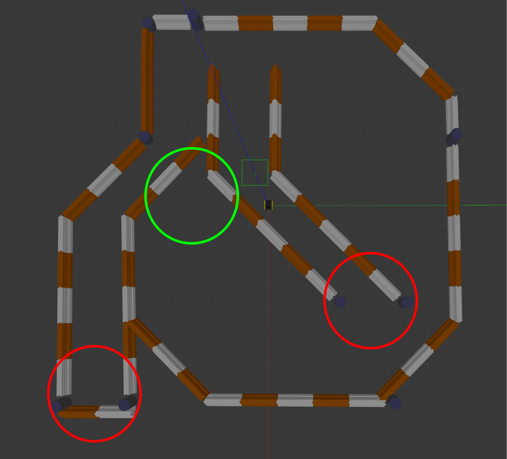

# Navigation
This assignment will teach you how to set up a navigation system in ROS and how to command it with a state machine.

## Assignment 3.1: Mapping, Localization and Navigation.
Ensure all your dependencies are installed by going to your `catkin_ws` folder and running `rosdep install --from-paths src --ignore-src -r`.

Now follow [this](https://www.clearpathrobotics.com/assets/guides/melodic/ros/ROS%20Navigation%20Basics.html) tutorial to launch the simulated system and build a map.

**Note**: You can skip the sections where things are installed or cloned.

1. Place the map you create in the `maps` directory of this folder.
2. Take a screen recording of you sending the robot to the bottom-left-most part of the map using the map you created. Add this to the `results` directory.

## Assignment 3.2: Task Execution
Create a state machine using `smach` that does the following:
1. Takes the robot to each of the double-post areas of the map, marked in red below.
2. When at a double-post area, saves one laser scan message, then rotates 180 degrees,then saves another laser scan.
3. Returns to the home zone, marked in green below.
4. Prints to the terminal the four laser scans saved.
5. If any navigation goals fail, the robot should return home then the state machine should end as failed. If any attempt to navigate home fails, the state machine should end as failed.

Use the following resources:
- Smach: http://wiki.ros.org/smach/Tutorials
- move_base: http://wiki.ros.org/move_base#Action_API
- Getting a single ROS message: https://answers.ros.org/question/345674/what-does-rospywait_for_messagescan-laserscan-mean/

Submit your code in the `scripts` directory.
Submit a diagram of your state machine in the `results` directory.